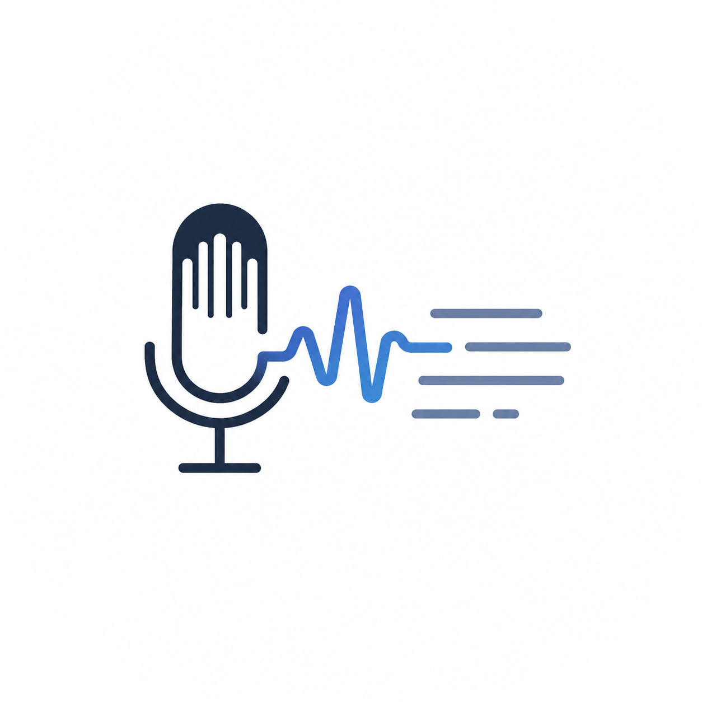
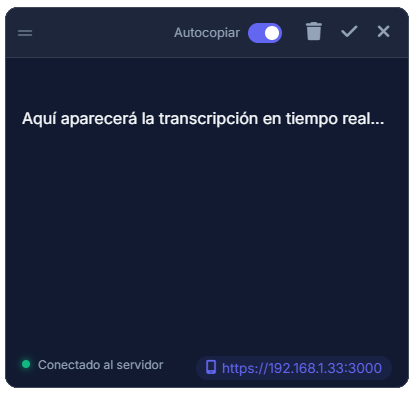

  
  
  <h1>🎙️ Dicta</h1>
  
  

    <b>Transcribe tu voz en el móvil y cópiala en tu PC en tiempo real.</b>
  

  

    <a href="#-características">Características</a> •
    <a href="#-uso-rápido">Cómo usar</a> •
    <a href="#️-tecnologías-utilizadas">Tecnologías</a>
  

  
  

 

> **Dicta** es una aplicación dual (Web y Escritorio) que te permite utilizar el micrófono de tu teléfono móvil para dictar texto y verlo aparecer al instante en la pantalla de tu ordenador. Olvídate de mandarte mensajes a ti mismo para pasar texto. Simplemente abre Dicta en tu PC, conéctate desde tu móvil, ¡y empieza a hablar!

---

## ✨ Características

- ⚡ **Tiempo Real**: Sincronización instantánea entre tu móvil y tu PC gracias a Socket.io.
- 🤖 **Autocopiado Inteligente**: La aplicación detecta cuándo dejas de hablar (1 segundo de silencio) y copia automáticamente el texto a tu portapapeles sin que toques nada.
- 🌐 **Enlace Dinámico Directo**: Tu PC detectará su IP local y te la mostrará cómodamente en pantalla para que sepas qué URL exacta introducir en el móvil con un solo clic.
- 📱 **Interfaz Web Premium**: Un diseño *Glassmorphism* moderno y elegante en el navegador.
- 💻 **Widget Flotante (PC)**: El cliente de Windows funciona como un pequeño widget transparente y arrastrable "siempre por encima" que no molesta en tu pantalla.
- 🔒 **Certificados SSL Automáticos**: Generación de HTTPS al vuelo para que iOS y Android te permitan usar el micrófono de forma segura.

---

## 🚀 Uso Rápido

### 💻 En tu PC (Windows)
Descarga la aplicación portable o ejecuta el código fuente. Se abrirá un pequeño widget transparente.
- Si usas el código fuente: Ejecuta `npm start` (o `start.bat`).

### 📱 En tu Móvil
1. Asegúrate de estar en la misma red Wi-Fi que el ordenador.
2. Abre en tu móvil la **URL exacta** que aparece en la esquina inferior izquierda del widget de PC (ej. `https://192.168.1.33:3000`). ¡Puedes hacer clic en ella para copiarla!
3. *(Nota: Te saldrá un aviso de que la conexión no es privada. Haz clic en Avanzado -> Continuar).*
4. Dale al botón de **Empezar a Escuchar** y permite el acceso al micrófono.
5. ¡Empieza a hablar y verás el texto en tu PC copiándose mágicamente!

---

## 🧠 ¿Cómo funciona la transcripción?

¡La magia ocurre sin instalar pesadas inteligencias artificiales en tu PC! 

Dicta aprovecha la **Web Speech API** integrada de forma nativa en los navegadores modernos (como Safari, Chrome o Edge). Cuando hablas por tu móvil:
1. **Reconocimiento Nativo**: El navegador de tu teléfono procesa el audio utilizando los motores de reconocimiento de voz de Apple o Google (altamente precisos y rápidos).
2. **Eventos en Vivo**: A medida que hablas, el navegador nos va enviando el texto parcial (interim) y final.
3. **Sincronización Ultrarrápida**: Capturamos ese texto con JavaScript y lo enviamos a través de **WebSockets** (`Socket.io`) a tu servidor local.
4. **Pantalla del PC**: El widget de Windows recibe el texto en milisegundos y te lo muestra en pantalla, listo para copiar.

Todo el tráfico es local y seguro (gracias a los certificados HTTPS autogenerados), haciendo que la latencia sea prácticamente cero.

---

## 🛠️ Tecnologías Utilizadas

- **Frontend**: HTML5, CSS3 Vanilla, JavaScript (Web Speech API).
- **Backend**: Node.js, Express, Socket.io.
- **Escritorio**: Electron.

  
Creado con ❤️ para facilitar tu día a día.

